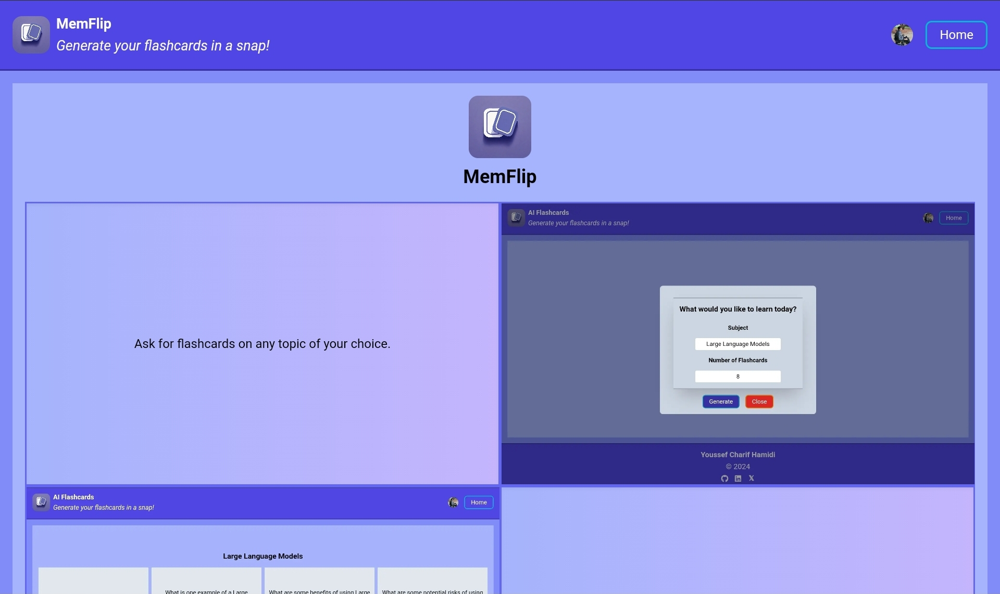
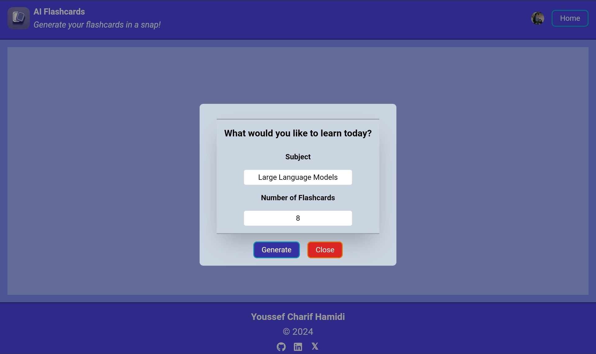
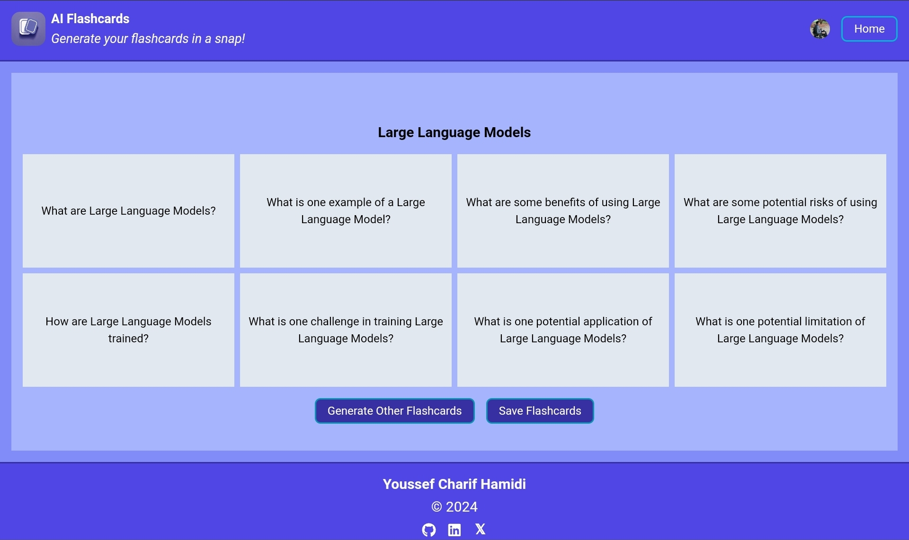
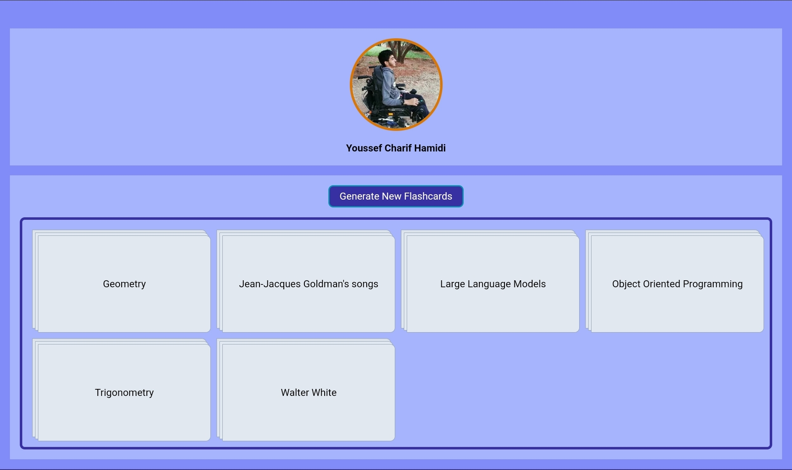
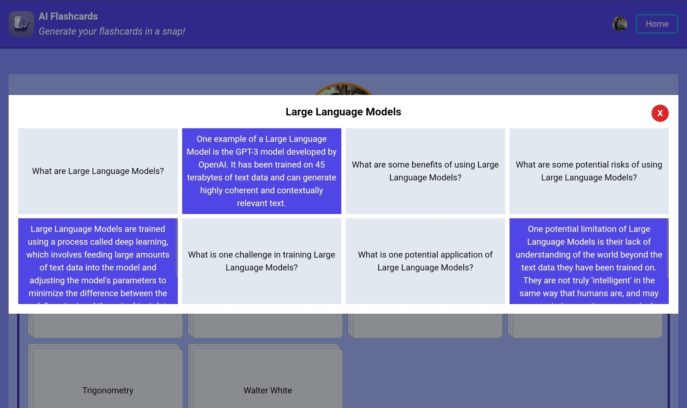

# MemFlip

## Overview

Welcome to **MemFlip**! MemFlip is your go-to app for generating flashcards on any topic, powered by cutting-edge AI. Whether you're studying for an exam, learning a new language, or just curious about something, MemFlip makes it easy to create, save, and review flashcards. Ready to enhance your learning experience? [Check it out here!](https://mem-flip.live)

## Features

### 1. Request Flashcards on Any Topic

Simply enter a topic of your choice, and MemFlip will generate a set of flashcards tailored to your needs.

### 2. Save or Generate New Flashcards

Once you've generated a set of flashcards, you can save them for future use or request a new set if you want to explore different content.

### 3. Access Your Saved Flashcards

Easily access all your previously saved flashcard sets in one place. No need to worry about losing your study material.

### 4. Review Your Flashcards

Open any saved flashcard set and start reviewing right away. It's simple and effective for retaining knowledge.

## Tech Stack

- **Framework: Next.js**  
  Next.js was chosen for its powerful features like server-side rendering (SSR) and static site generation (SSG), which provide a fast and optimized user experience. Its file-based routing and built-in API routes make it easy to manage and scale the application.

- **AI Implementation: Groq API**  
  The Groq API powers the AI-driven flashcard generation in MemFlip. It's a highly efficient tool for creating dynamic, contextually relevant flashcards on any topic, ensuring that the content is both accurate and personalized.

- **Styling: Tailwind CSS**  
  Tailwind CSS is utilized for styling due to its utility-first approach, which allows for rapid UI development. Its responsive design capabilities and customizable nature make it ideal for creating a clean and consistent user interface.

- **Authentication and User Management: Clerk**  
  Clerk is used for authentication and user management, providing a seamless and secure login experience. It supports multiple authentication methods and simplifies the management of user sessions and profiles, enhancing the overall user experience.

- **Storage: Firestore**  
  Firestore is chosen for its flexible, scalable, and real-time database capabilities. It seamlessly integrates with Next.js, allowing for efficient storage and retrieval of user-generated flashcards. This ensures that data is reliably stored and quickly accessible.

## Conclusion

Thank you for using MemFlip! We hope our app helps you learn and retain information more efficiently. Your feedback is always welcome as we strive to improve and offer the best learning experience possible.
